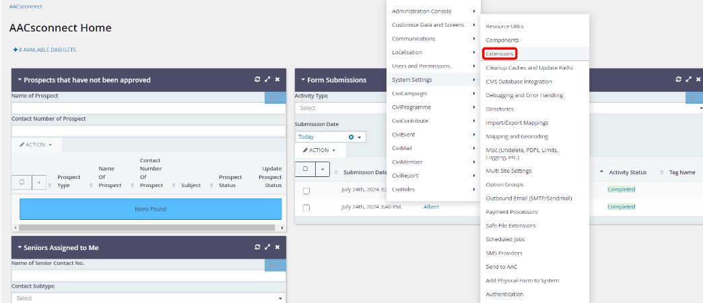
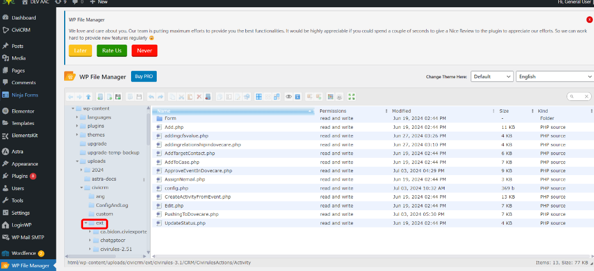
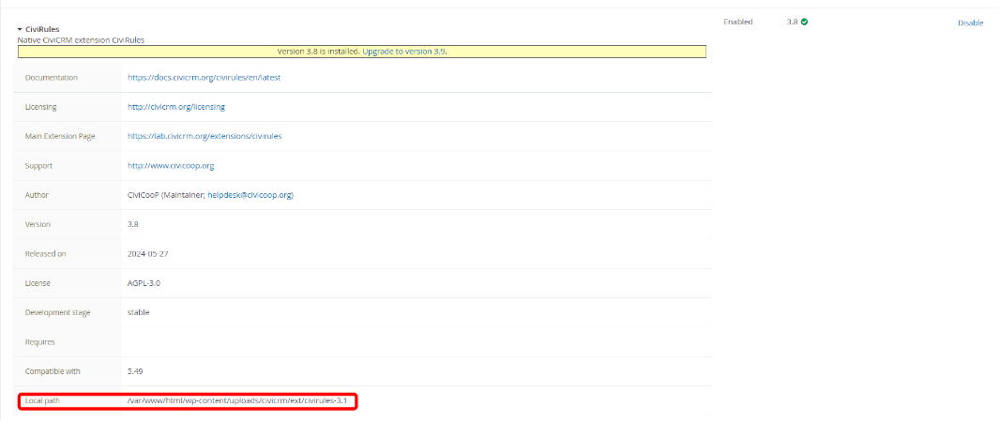
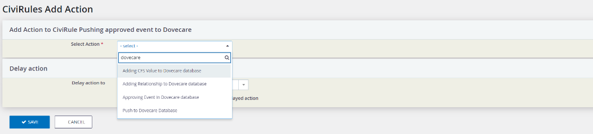

# org.civicoop.civirules

This extension pushes data such as the contact details and activities like AAPs. 

## Things to know before use

- 'addingcfsvalue.php' Add/Update the cfs value of the senior to dovecare when the CFS activty is created.

- 'addingrelationshipindovecare.php' Add the relationship to dovecare whenever a spouse relationship is added between seniors

- 'approveEventinDovecare.php' Fetch the approved events and push to dovecare for seniors to sign up. 

- 'PushingToDovecare.php' Will first fetch the senior details and create a senior account in dovecare with the phonenumber as the username and first 3 letter of the full name + their DOB (YYYYMMDD format) as their password.

- 'config.php' store the dovecare DB details.
## How to set up the custom civirule
1. Firstly, head over to WP file manager and upload this folder under ext. (wp-content/upload/civicrm/ext/) 

2. Secondly, in the Navigation Menu, hover over Administer and then "System Settings" then click on "extension"

3. Thirdly, scroll down to civirules and make sure the file path is the same. After it matches, enable the file

## Expected result

All the custom action will appear if u create a civirule and select on actions

