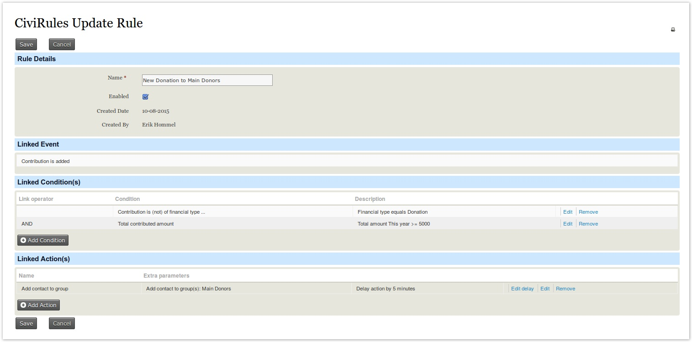
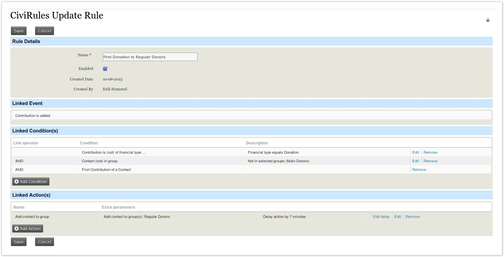
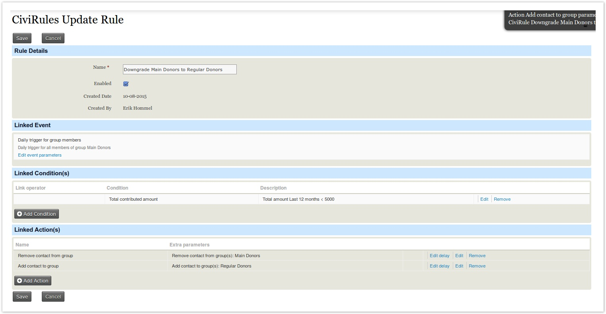
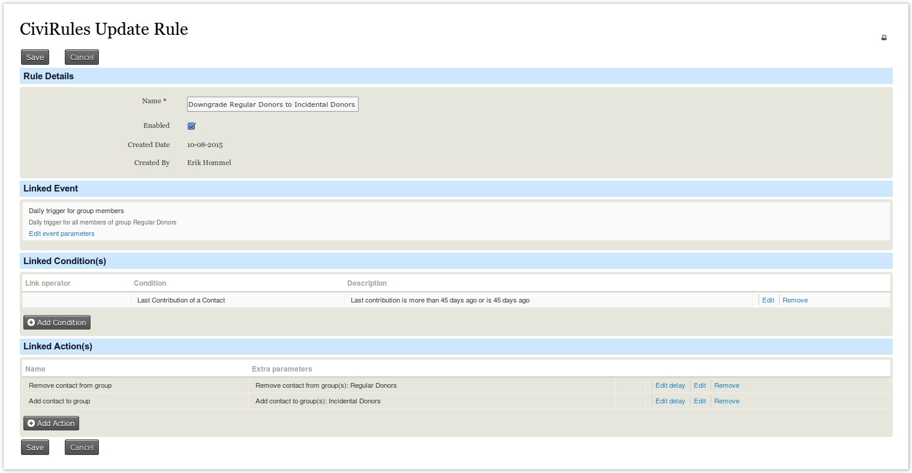
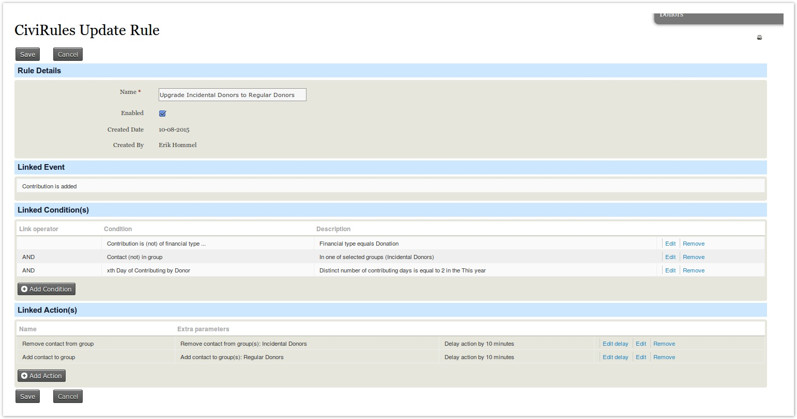

## Introduction

This example will show you how to set up CiviRules to automatically classify your donors in groups. The groups can then be used to regulate the communications with the donors, and reporting. The example is basic, but you should be able to get the idea from this example. Obviously it is possible to make it more diffiicult, set up more CiviRules and do all sorts of wonderful stuff.

In the example I will use the following set of functional rules to classify the donors:

1. A donation is a contribution of the financial type 'Donation'
1. Any donor that has contributed 5000 or more donor this year is considered a Main Donor
1. Any donor that contributes for the first time is initially seen as a Regular Donor
1. If a Regular Donor has not contributed for 45 days or longer, the contact is downgraded to Incidental Donors
1. If a Main Donor has contributed less than 5000 in the last 12 months, the contact is downgraded to Regular Donors
1. If an Incidental Donor donates for the second time in this year the contact is upgraded to Regular Donors

My group setup in CiviCRM:

## New Donation to Main Donors

The first CiviRule we need to set up is the rule that checks if the donor has contributed 5000 or more the donor is added to the group Main Donors. This rule should be checked first as this is the group of our most valualble donors. If a donor is a Main Donor, nothing else needs to be checked for now.

The moment of checking, the trigger of the CiviRule, is when a new contribution of the financial type 'Donation' is added. It is wise to add a delay of 5 minutes, so the user can correct any typo's like accidently entering an amount of 5000 rather than 500 :-).

We also need to check if the total amount that this donor has donated in the last 12 months is 5000 or more. All this combined means:

1. the trigger for the CiviRule is 'Contribution is Added'
1. the first condition of the CiviRule is 'Contribution is of Financial Type Donation'
1. the second condition (linked with AND) is 'Total Amount Contributed This Year is Greater Than or Equal to 5000'
1. the action with a delay of 5 minutes is 'Add contact to group Main Donors'

## First Donation to Regular Donors

The next CiviRule is the one that adds donors to Regular Donors if required. This rule has to be the second one, and will be processed with a delay of 7 minutes to allow for the correction of typing errors andmaking sure the first check has already taken place. We should not classify donors that are already Main Donors as regular ones!

The initial addition to Regular Donors is only done for the first contribution. The contact is then either downgraded if no more contributions are added, upgraded if the total amount goes over 5000 or stays in the group.

So the CiviRule needs to have:

1. the trigger for the CiviRule is 'Contribution is Added'
1. the first condition of the CiviRule is 'Contribution is of Financial Type Donation'
1. the second condition (linked with AND) is 'Contact is NOT member of group Main Donors'
1. the third condition is 'Contribution is First Contribution of Contact'
1. the action with a delay of 7 minutes is 'Add contact to group Regular Donors'

##  Downgrade Main Donors

This CiviRule is one that runs with the scheduled job on a daily basis (if that is how I configured the scheduled job). The CiviRule should check for each member of the group Main Donors if the contact should still be considered as a Main Donor. This is the case if the donor has contributed 5000 or more in the last 12 months.

So for example if a contact donated 7500 on 3 March 2015, the contact will be added to group Main Donors with the first CiviRule CiviRuleDowngradeMainDonors). If the contact then ceases to donate this CiviRule will downgrade the contact to Regular Donors on 4 March 2016.

1. the trigger for the CiviRule is 'Daily Trigger for Group Members of Main Donors'
1. the condition of the CiviRule is 'Total Contributed Amount in the last 12 Months is less than 5000'
1. the first action 'Remove from Group Main Donors'
1. the second action is 'Add contact to group Regular Donors'

## Downgrade Regular Donors

This CiviRule is one that runs with the scheduled job on a daily basis (if that is how I configured the scheduled job). The CiviRule should check for each member of the group Regular Donors if the contact should still be considered as a Regular Donor. This is the case if the donor has contributed in the last 45 days.

So for example if a contact donated 7500 on 3 March 2015, the contact will be added to group Main Donors with the first CiviRule CiviRuleDowngradeMainDonors). If the contact then ceases to donate this CiviRule will downgrade the contact to Regular Donors on 4 March 2016. The next day the donor will be downgraded to Incidental Donors.

1. the trigger for the CiviRule is 'Daily Trigger for Group Members of Regular Donors'
1. the condition of the CiviRule is 'Last Contribution of a Contact is More than 45 Days Ago or 45 Days Ago'
1. the first action 'Remove from Group Regular Donors'
1. the second action is 'Add contact to group Incidental Donors'

## Upgrade Incidental Donors

An Incidental Donor can become a Regular Donor again if the contact donates for the second time in this year. This needs to be checked at each new contribution, but only if the contact is not already a Main or Regular Donor. So the delay should be set to 10 minutes to allow time for typing error correction, but also ensuring the CiviRules classifying the contact as a Main or Regular Donor are already processed.

The CiviRule has to contain:

1. the trigger for the CiviRule is 'Contribution is Added'
1. the first condition of the CiviRule is 'Contribution is of Financial Type Donation'
1. the second condition of the CiviRule is 'Contact is Member of the Group Incidental Donors'
1. the third condition (linked with AND) is 'Distinct number of contributing days is 2 in This Year'
1. the first action with a delay of 10 minutes is 'Remove from Group Incidental Donors'
1. the second action with a delay of 10 minutes is 'Add to Group Regular Donors'

## Conclusion

With the set of CiviRules defined in this example I have now automated the donor classification. Obiously I can set up lots of additional CiviRules to send Thank You emails to each specific donor group and stuff like that.

The overall picture is now:

