## Introduction to the Field Value Comparison Condition

As explained in the other chapters of this cookbook there are a couple of pre-defined Conditions that can be used to make sure an action is only executed in certain circumstances. For example, the action 'move to group VIP donor' is based on the trigger 'Contribution is added' and Conditions:

1. contribution is of financial type 'Donation'
1. contribution has status 'Completed'
1. contact is not in group 'VIP donors'

It is also relatively easy to create your own Condition (explained in section). However, there is one powerful pre-defined Condition which basically enables you to check any field in CiviCRM in that Condition. That is the Field Value Comparison Condition.

In CiviRules you select a trigger, which is linked to a CiviCRM _entity_. For example, a new contribution is added. The entity is then contribution. As the contribution is always linked to a contact, you will also possibly want to check something with the entity Contact. In fact, almost everything in CiviCRM is linked to the entity Contact so you will probably always have this entity as well as the one related to your trigger.

The Condition **Field Value Comparison** will allow you to select the _Entity_ you want to check against (so in the example Contribution and Contact) and then allow you to select all the database _fields_ related to that entity, including the custom fields. You will then get the possiblity to add a value that the field should be tested against. In theory you should be able to test any value in the CiviCRM database in your conditions. It might get a bit complicated if you combine many but you can!

Below you will find a few examples that will demonstrate this.

## Dates in Field Value Comparison Conditions

All dates are in format `YYYYMMDD`, but you can enter dates in any format that PHP understands and they will be converted when the condition is evaluated. This includes [relative dates](https://www.php.net/manual/en/datetime.formats.relative.php), so you can enter dates like `today`, `-1 year`, `3 days ago`, or `first day of` (for the first day of the month). Note that the condition description will show the current evaluated date, rather than the value you entered (e.g. if you enter `today`, the description will show today's date), but the comparison date will be evaluated every time the condition is checked. 

Note that any time component of the date is ignored. Only dates are compared, never times.

## Example: Create Activity when Participant Registers for Event but Has no Email

In this example I want to catch an Event Participant that register for my event, but has flagged 'Do Not Email' so he/she does not get a confirmation by email. In this case I want to create an Activity for Bob Watson to send the confirmation by snailmail.

First step is to create the Rule and give it a name:

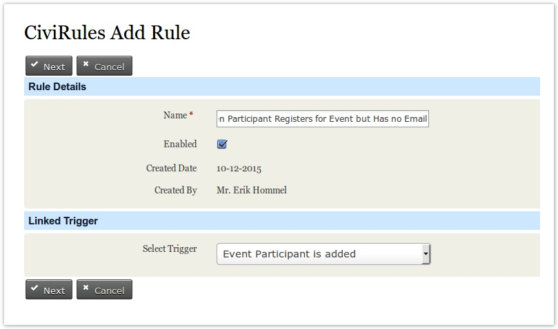

Once I have done that I click 'Next' and then get to the summary of this specific Rule:

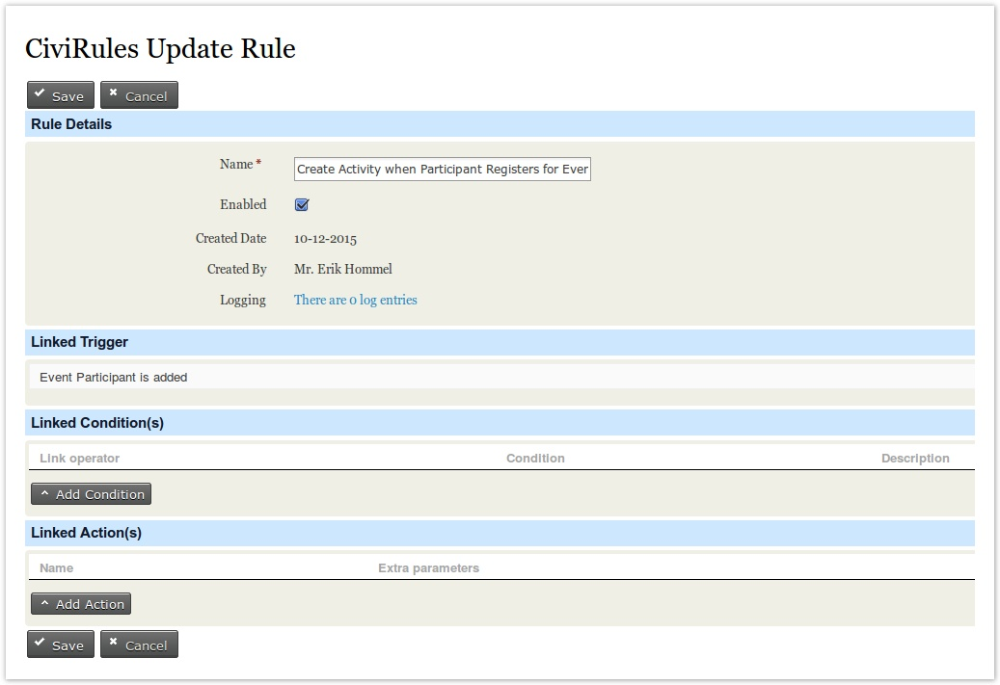

As you can see I have selected 'Event Participant is added' as the trigger. Next step is to add the conditions that will check the status of the participant and if the contact has an email. To do that I click on the 'Add Condition' button in the specific Rule summary and then select the Condtion 'Field Value Comparison':

I click on 'Save' and then get a form where I can detail the Condition.

On this form I can select the _Entity_. If I click on the Select Box here I will see that I get Contact and Participant as possible entities. I can also select the _field_ I want to test against, the operator and the value against which I want to compare. In this example I want to test if the field __Do Not Email__ has the value __yes__.

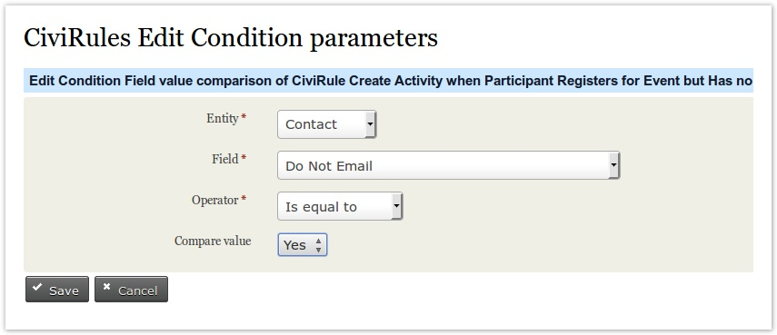

Finally I add the action which will create the Activity for Bob Watson:

In total I have now set up the Rule as listed below using only 'Field Value Comparison' Conditions:

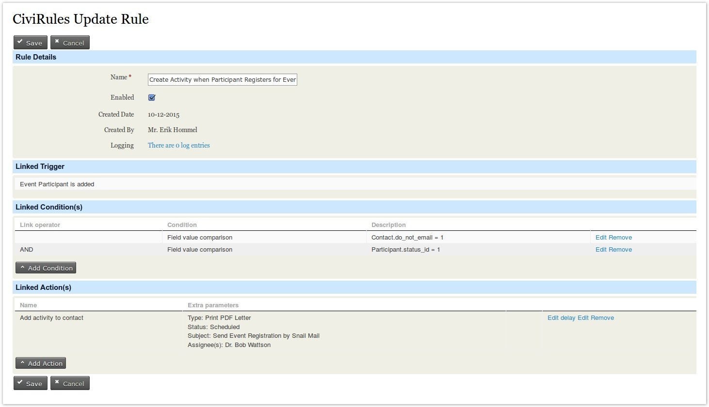

Bob Watson now has the Activity on his summary and I could create a dashlet for his dashboard with all the registration confirmations he has to send:

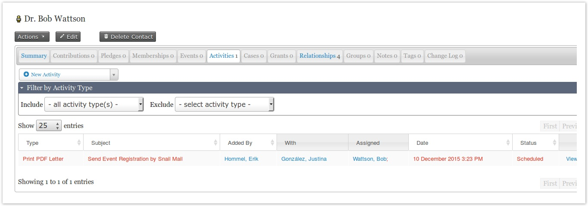

!!!Note
    Select List with Values
    As you can see the possible values are shows as select lists if that makes sense, in this example for the Do Not Email field and for the Participant Status field. In some exceptional cases you might not get a select list, but simply a field where you can enter a value. That might be because there is no reason for a select list (last_name = "Jones") OR when a select list would make sense but the internal engine can not find the link to the option values linked to the field. In that case you will have to find out the value you want from Administer/System Settings/Option Groups and find the one you want.

## Example: Add to Group When Pledge Becomes Active

When a Pledge becomes active (meaning the first payment comes in and the pledge status goes to 'In Progress') I want to add the contact to the group 'Active Pledgers'.

In this example I have the Green Technology Center which has pledged 6000 USD in the coming year. I want to make sure that when the first payment comes in, the organization is automatically added to the CiviCRM group (mailing list) Active Pledgers. The pledge looks like this when I start:

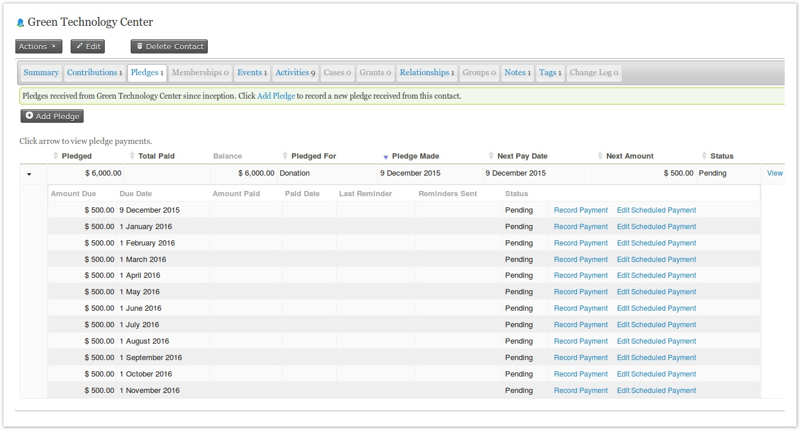

So I will be working with the CiviCRM Entity _Pledge_ and the CiviCRM Entity _Contact_. I am now going to create the Rule and give it a name:

I have selected to use the Trigger 'Pledge is changed', based on the fact that if the first pledge payment comes in the status of the Pledge is changed from 'Pending' to 'In Progress' automatically by CiviCRM. If I hit 'Next' I will move to the **Rule** summary:

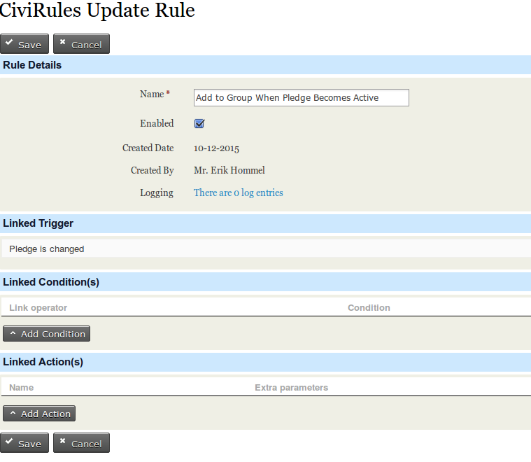

Next step is to add the conditions that will check the status of the pledge. To do that I click on the 'Add Condition' button in the specific Rule summary and then select the Condtion 'Field Value Comparison':

I click on 'Save' and then get a form where I can detail the Condition.

On this form I can select the Entity. If I click on the Select Box here I will see that I get Contact and Pledge as possible entities. I can also select the field I want to test against, the operator and the value against which I want to compare. In this example I want to test if the field Pledge Status has the value In Progress. 

!!! Note
    __Select List with Values__

    As you can see the possible values are shows as select lists if that makes sense, in this example for the Do Not Email field and for the Participant Status field. In some exceptional cases you might not get a select list, but simply a field where you can enter a value. That might be because there is no reason for a select list (last_name = "Jones") OR when a select list would make sense but the internal engine can not find the link to the option values linked to the field, as is the case in this example. I will now have to find out the value I want from `Administer/System Settings/Option` Groups. In this example I will have to check the option group __contribution status__ and will then find out the status _In Progress_ has the value __5__.

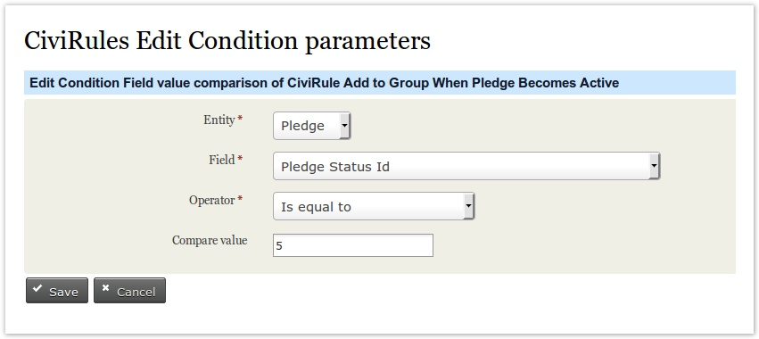   

I will now also add the __Condition__ that checks if the contact in this case is not a member yet of the group he/she should move to. If he/she is there is no reason to add them again (as this would change the start date of the membership of the group):

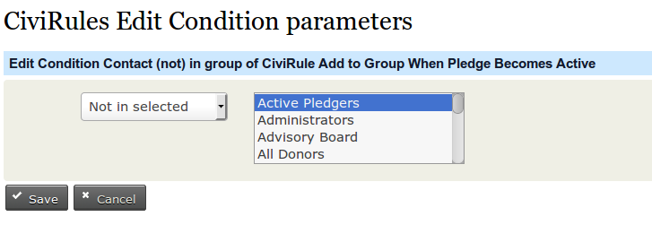  

Finally I set the Action to add the contact to the group:

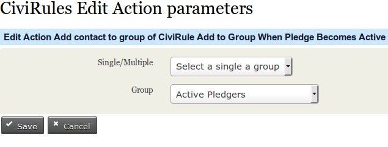

In total I have now set up the Rule as listed below using THE 'Field Value Comparison' Condition and the 'Contact (not) in Group' Condition:

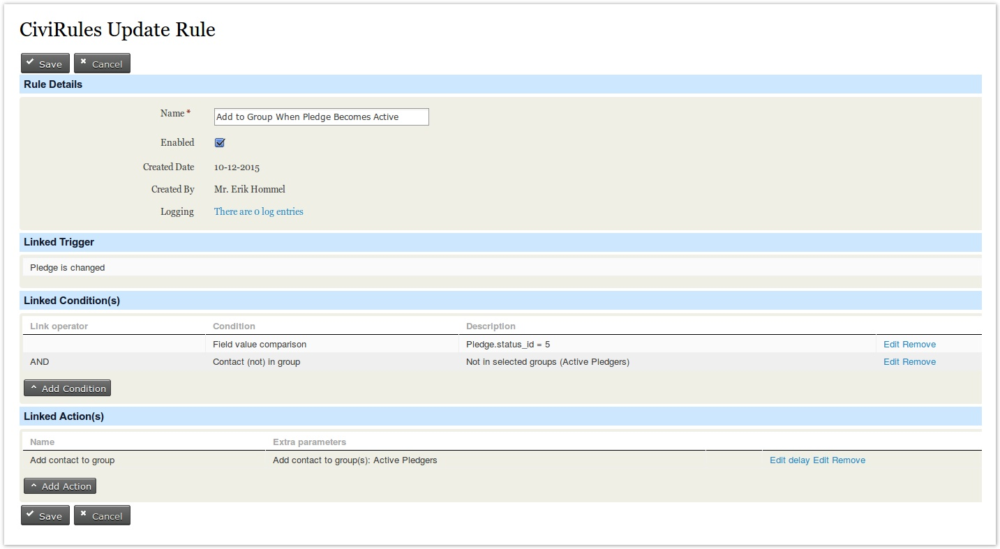

If I now record the first payment on the Pledge the status will be changed and the contact will be added to the group:

  

## Example: Create Survey Activity when Case is Resolved

When a Case of the type Housing Support is completed (case status becomes Resolved) an activity 'Send Survey to Case Client' will be created for Elizabeth Cooper.

Billy Barkley has a Case Housing Support which will be set to Resolved (status is now Ongoing) as soon as we have configured the CiviRule:

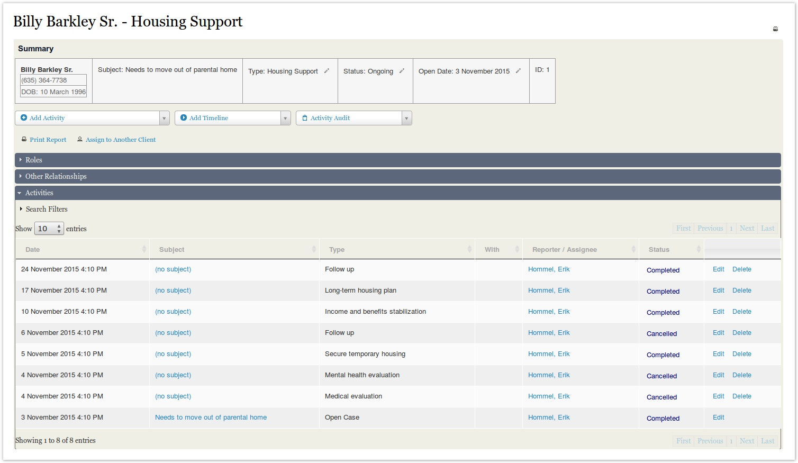

So in this Example I want to use the trigger 'Case is Changed' and use Conditions on the Entity Case to check if the field status now has the value Resolved.

First I will create the __Rule__ and give it a name:   

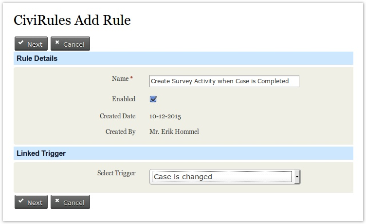

Once I have done that I click 'Next' and then get to the summary of this specific Rule:

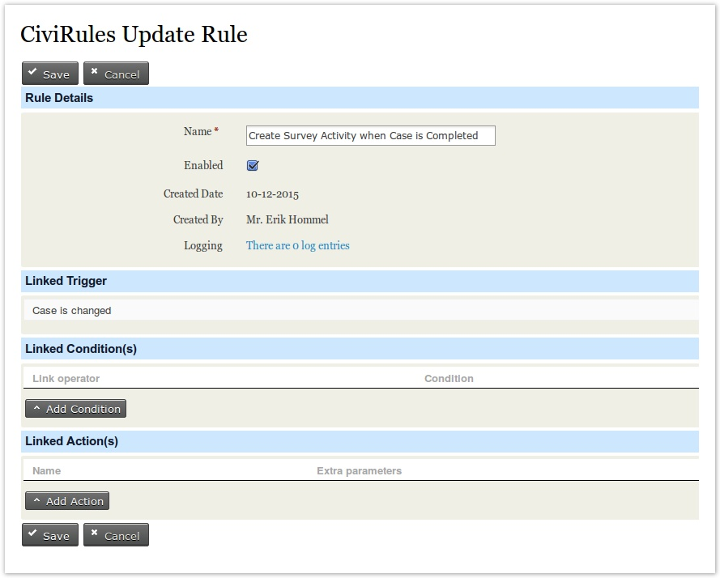

As you can see I have selected 'Case is Changed' as the trigger. Next step is to add the _conditions_ that will check the status of the case and the type of case. To do that I click on the 'Add Condition' button in the specific Rule summary and then select the Condtion 'Field Value Comparison':

I click on 'Save' and then get a form where I can detail the Condition.

On this form I can select the _Entity_. If I click on the Select Box here I will see that I get Contact, Relationship and Case as possible entities. I can also select the field I want to test against, the operator and the value against which I want to compare. In this example I want to test if the field __Case Status__ has the value __Resolved__, and if the field __Case Type__ has the value __Housing Support__.

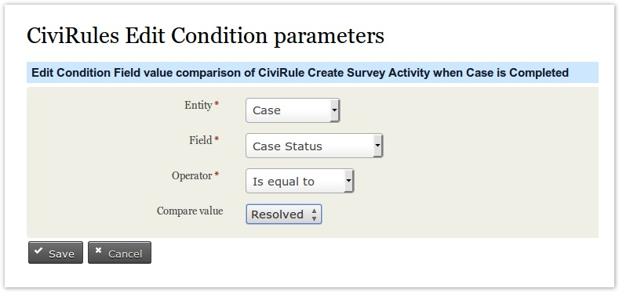
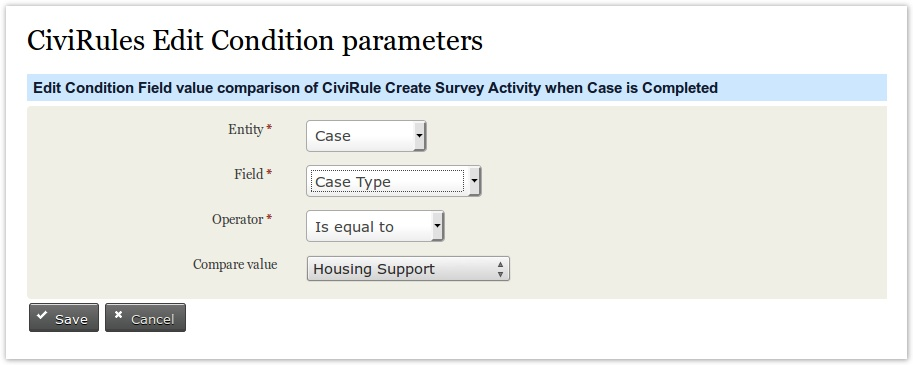

Finally I add the action which will create the Activity for Elizabeth Cooper:

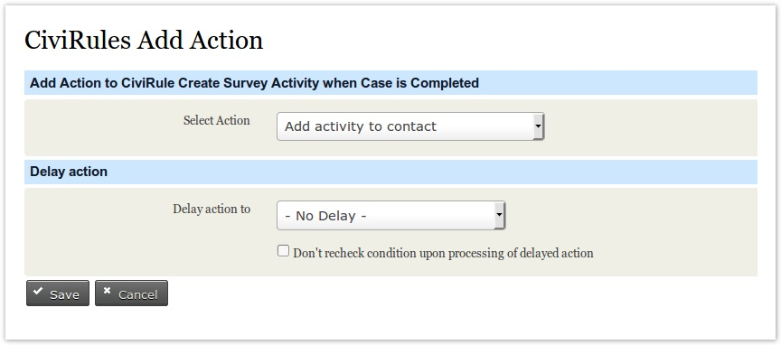

and when I click Save here:

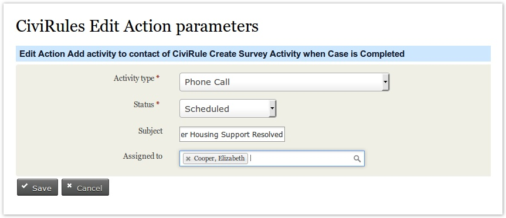

In total I have now set up the Rule as listed below using only 'Field Value Comparison' Conditions:

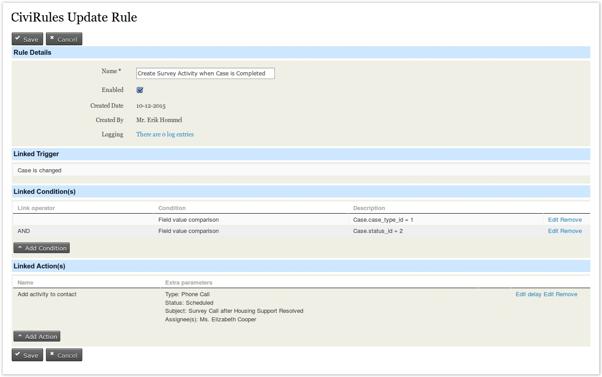

If I now change the status of the Case of Billy Barkley to resolved I can see the Activity for him and for Elizabeth Cooper:

 

