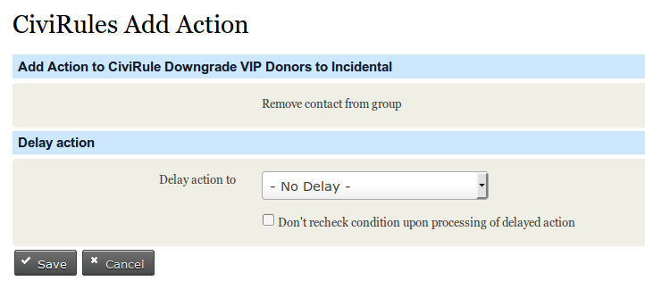

You can delay the execution of an action in CiviRules. This can be used for a number of things:

- something like sending a email with a next ask for a donation 30 days after adding the current donation
- minimizing the risk of typo's during data entry. For example if I want to add a contact to the group Major Donors if the donor adds more than 5000, I might use a delay of 5 minutes to correct the donation if I entered 10000 accidently where the donation is for 1000
- building a hierarchy. For example, if I want to add a contact to Major Donors if the donation is more than 5000 and to Important Donors if the donation is more than 2500. Both conditions will be met for a donation of 6000. I can obviously change the condition for the Important Donors to donation is more than 2500 AND donation is less than 5000, but I could also add a condition that the donor is NOT in the group Major Donors and set a delay for the Important Donors action. In that case for a donatio nof 6000 the donor would already be in the group Major Donors at the time the Important Donor action is executed.

A delayed action means that:

- all conditions are checked as they are when there is no delay
- the action is not executed immediately, but a queue item is created in the table civicrm_queue_item. This is done in the static method `CRM_CiviRules_Engine::delayAction`.

- the delayed actions will be picked up for execution by a scheduled job that will be added to your installation when you install CiviRules:


!!! Note 

    Note that there is an option which specifies when a delay is used if the conditions of the rule are checked:

    - __both__ at the time when the rule is triggered (and the action is queued) __and__ when the action is executed (which could be days or even weeks later). This is the default behaviour, you leave the tick box __unticked__.
    - __only__ at the time when the rule is triggered (and the action is queued). To get this behaviour tick the box.
    

## Adding Delays

Initially a couple of delays were added:

- day of week (so every Thursday for example)
- nth weekday of month (so for example every second Wednesday)
- a number of days
- a number of minutes

It is quite easy to add delays by extending the class `CRM_Civirules_Delay_Delay`. Here is the example of the minutes delay:

```php
class CRM_Civirules_Delay_XMinutes extends CRM_Civirules_Delay_Delay {
 
  protected $minuteOffset;
 
  public function delayTo(DateTime $date) {
    $date->modify("+ ".$this->minuteOffset." minutes");
    return $date;
  }
 
  public function getDescription() {
    return ts('Delay by a number of minutes');
  }
 
  public function getDelayExplanation() {
    return ts('Delay action by %1 minutes', array(1 => $this->minuteOffset));
  }
 
  public function addElements(CRM_Core_Form &$form) {
    $form->add('text', 'xminutes_minuteOffset', ts('Minutes'));
  }
 
  public function validate($values, &$errors) {
    if (empty($values['xminutes_minuteOffset']) || !is_numeric($values['xminutes_minuteOffset'])) {
      $errors['xminutes_minuteOffset'] = ts('You need to provide a number of minutess');
    }
  }
 
  public function setValues($values) {
    $this->minuteOffset = $values['xminutes_minuteOffset'];
  }
 
  public function getValues() {
    $values = array();
    $values['xminutes_minuteOffset'] = $this->minuteOffset;
    return $values;
  }
}

```